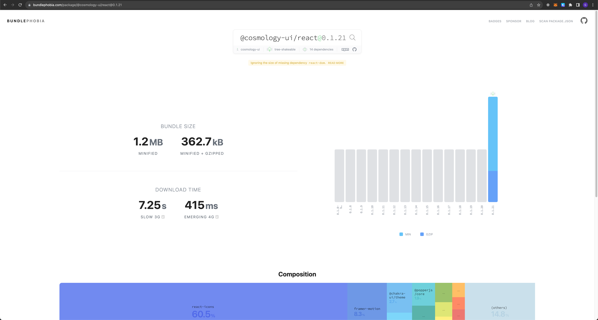
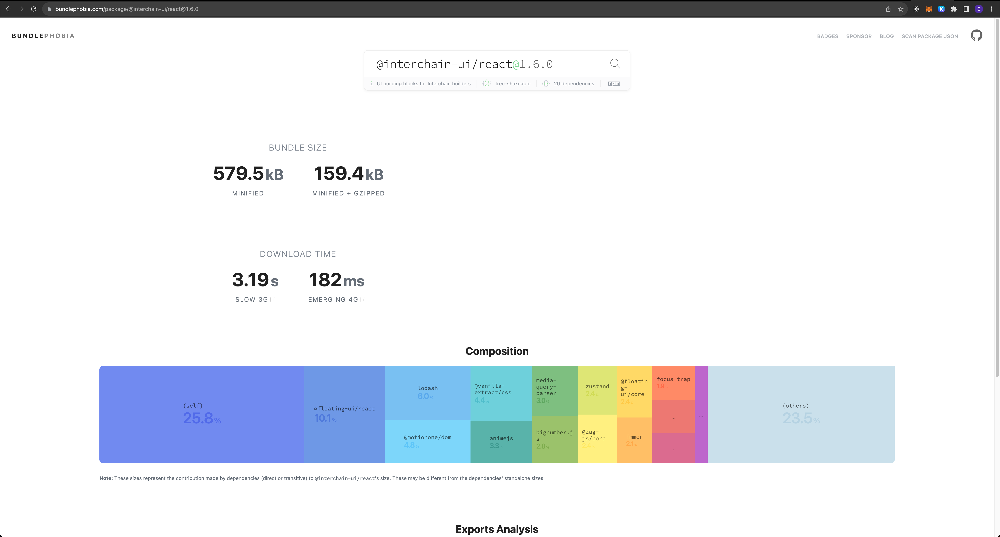
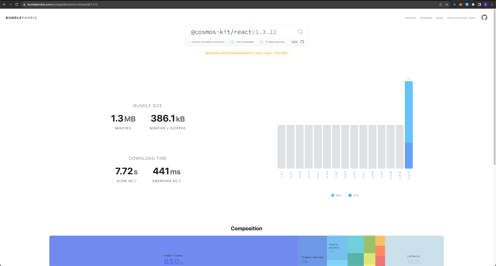
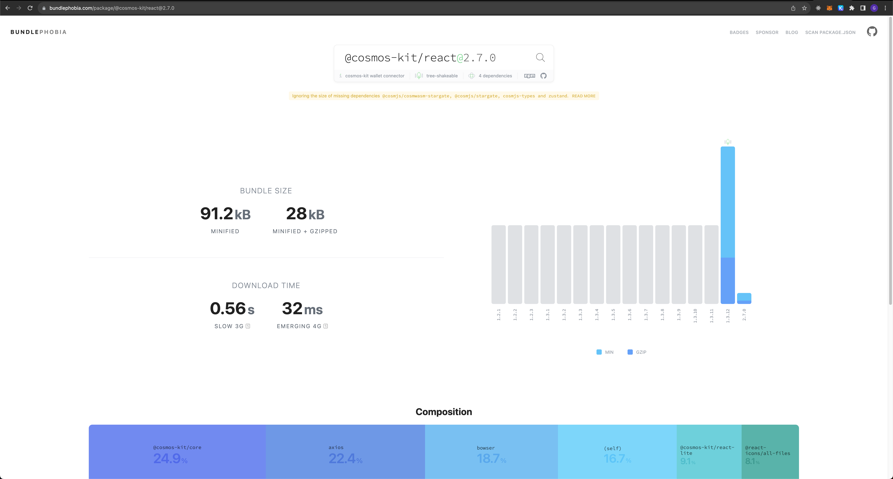

# Migration from V1 to V2

## Major Changes

1. `ChakraUI` Removed

In CosmosKit V2, we discard the dependency on `ChakraUI` due to numerous runtime errors and the cost of CSS-in-JS.

Main changes lie in `@cosmos-kit/react`, where the default modal locates. All the modal components are imported from `@interchain-ui/react`, which is our UI Kit in Cosmology. The latest `@interchain-ui/react` discards `ChakraUI` and instead adopts a pure CSS styling solution through a package called `vanilla-extract`.

2. Build Process Changed

In CosmosKit V2, we used pure `tsc` to compile CommonJS, ESM (es2022) instead of `babel`. Also, `.js` and `.d.ts` files are no longer to be separated in different folders, in this way non-index sources can easily find its corresponding types.

## Migration Guides

1. In CosmosKit V2, we require developers to install `@interchain-ui/react` and require **`import "@interchain-ui/react/styles"`** in your top-level route/layout if you are using our default modal in `@cosmos-kit/react`. i.e. in [`_app.tsx`](https://github.com/hyperweb-io/cosmos-kit/blob/af05600fd1913e0d3eb1bbef05382c1a06c6af69/packages/example/pages/_app.tsx#L4) for next project.

2. We don't export `defaultTheme` anymore in `@cosmos-kit/react` in CosmosKit V2.

3. `WrappedWithChakra` and `modalTheme` is removed in properties of `ChainProvider` from `@cosmos-kit/react`.

4. `Web3Auth` wallet instance import has been replaced by constructing the wallet instance with a wallet generator function. In this way the web3auth implementation becomes much more secure, and also makes it support any of the login providers. See details [here](/integrating-wallets/web3auth)

## Customizing the default modal

Customizing the default modal styles is done through `modalTheme` prop of `<ChainProvider />`

We are currently providing 2 ways to customize the default modal:

1. Overriding the theme object:

By using the `modalTheme.themeDefs` and `modalTheme.customTheme`, you can override all of the theme tokens however you want

```TSX

<ThemeProvider
  themeDefs={[
    {
      {/* Provide a unique name for your custom theme */}
      name: ``,
      vars: {
        colors: {
          {/* Override your branding colors */}
          primary500: ``,
        },
        space: {
          {/* Or spacing tokens */}
        }
      },
    },
  ]}
  {/* Custom theme name, this corresponds to one of the theme provided in themeDefs prop */}
  customTheme="custom"
>
  {children}
</ThemeProvider>
```

The full object shape of `themeDefs[index].vars` is as below

```json
{
  colors: {
    primary: ``,
    body: ``,
    background: ``,
    link: ``,
    linkHover: ``,
    text: ``,
    textSecondary: ``,
    textDanger: ``,
    textWarning: ``,
    textPlaceholder: ``,
    rewardBg: ``,
    rewardContent: ``,
    cardBg: ``,
    inputBorder: ``,
    inputBg: ``,
    inputDangerBorder: ``,
    inputDangerBg: ``,
    inputDisabledBg: ``,
    inputDisabledText: ``,
    progressBg: ``,
    progressValue: ``,
    progressCursor: ``,
    divider: ``,
    menuItemBg: ``,
    menuItemBgHovered: ``,
    menuItemBgActive: ``,
    skeletonBg: ``,
    black: ``,
    blackPrimary: ``,
    white: ``,
    transparent: ``,
    current: ``,
    whiteAlpha50: ``,
    whiteAlpha100: ``,
    whiteAlpha200: ``,
    whiteAlpha300: ``,
    whiteAlpha400: ``,
    whiteAlpha500: ``,
    whiteAlpha600: ``,
    whiteAlpha700: ``,
    whiteAlpha800: ``,
    whiteAlpha900: ``,
    blackAlpha50: ``,
    blackAlpha100: ``,
    blackAlpha200: ``,
    blackAlpha300: ``,
    blackAlpha400: ``,
    blackAlpha500: ``,
    blackAlpha600: ``,
    blackAlpha700: ``,
    blackAlpha800: ``,
    blackAlpha900: ``,
    gray50: ``,
    gray100: ``,
    gray200: ``,
    gray300: ``,
    gray400: ``,
    gray500: ``,
    gray600: ``,
    gray700: ``,
    gray800: ``,
    gray900: ``,
    red50: ``,
    red100: ``,
    red200: ``,
    red300: ``,
    red400: ``,
    red500: ``,
    red600: ``,
    red700: ``,
    red800: ``,
    red900: ``,
    orange50: ``,
    orange100: ``,
    orange200: ``,
    orange300: ``,
    orange400: ``,
    orange500: ``,
    orange600: ``,
    orange700: ``,
    orange800: ``,
    orange900: ``,
    yellow50: ``,
    yellow100: ``,
    yellow200: ``,
    yellow300: ``,
    yellow400: ``,
    yellow500: ``,
    yellow600: ``,
    yellow700: ``,
    yellow800: ``,
    yellow900: ``,
    green50: ``,
    green100: ``,
    green200: ``,
    green300: ``,
    green400: ``,
    green500: ``,
    green600: ``,
    green700: ``,
    green800: ``,
    green900: ``,
    blue50: ``,
    blue100: ``,
    blue200: ``,
    blue300: ``,
    blue400: ``,
    blue500: ``,
    blue600: ``,
    blue700: ``,
    blue800: ``,
    blue900: ``,
    primary50: ``,
    primary100: ``,
    primary200: ``,
    primary300: ``,
    primary400: ``,
    primary500: ``,
    primary600: ``,
    primary700: ``,
    primary800: ``,
    primary900: ``,
    purple50: ``,
    purple100: ``,
    purple200: ``,
    purple300: ``,
    purple400: ``,
    purple500: ``,
    purple600: ``,
    purple700: ``,
    purple800: ``,
    purple900: ``,
  },
  font: {
    body: ``,
  },
  space: {
    "0": ``,
    "1": ``,
    "2": ``,
    "3": ``,
    "4": ``,
    "5": ``,
    "6": ``,
    "7": ``,
    "8": ``,
    "9": ``,
    "10": ``,
    "11": ``,
    "12": ``,
    "13": ``,
    "14": ``,
    "15": ``,
    "16": ``,
    "17": ``,
    "18": ``,
    "19": ``,
    "20": ``,
    "21": ``,
    "22": ``,
    "23": ``,
    "24": ``,
    "25": ``,
    "26": ``,
    "27": ``,
    "28": ``,
    "29": ``,
    "30": ``,
    auto: ``,
    full: ``,
    fit: ``,
    max: ``,
    min: ``,
    viewHeight: ``,
    viewWidth: ``,
    none: ``,
  },
  borderWidth: {
    none: ``,
    sm: ``,
    base: ``,
    md: ``,
    lg: ``,
    xl: ``,
  },
  borderStyle: {
    none: ``,
    solid: ``,
    dotted: ``,
    dashed: ``,
    groove: ``,
    ridge: ``,
    hidden: ``,
    double: ``,
    inset: ``,
    outset: ``,
    unset: ``,
  },
  boxShadow: {
    xs: ``,
    sm: ``,
    base: ``,
    md: ``,
    lg: ``,
    xl: ``,
    "2xl": ``,
    inset: ``,
    primaryOutline: ``,
    none: ``,
    "dark-lg": ``,
  },
  radii: {
    none: ``,
    sm: ``,
    base: ``,
    md: ``,
    lg: ``,
    xl: ``,
    "2xl": ``,
    "3xl": ``,
    "4xl": ``,
    full: ``,
  },
  letterSpacing: {
    tighter: ``,
    tight: ``,
    normal: ``,
    wide: ``,
    wider: ``,
    widest: ``,
  },
  lineHeight: {
    normal: ``,
    none: ``,
    shorter: ``,
    short: ``,
    base: ``,
    tall: ``,
    taller: ``,
  },
  fontWeight: {
    hairline: ``,
    thin: ``,
    light: ``,
    normal: ``,
    medium: ``,
    semibold: ``,
    bold: ``,
    extrabold: ``,
    black: ``,
  },
  fontSize: {
    "3xs": ``,
    "2xs": ``,
    xs: ``,
    sm: ``,
    md: ``,
    lg: ``,
    xl: ``,
    "2xl": ``,
    "3xl": ``,
    "4xl": ``,
    "5xl": ``,
    "6xl": ``,
    "7xl": ``,
    "8xl": ``,
    "9xl": ``,
    "10xl": ``,
    "11xl": ``,
    "12xl": ``,
    "13xl": ``,
    "14xl": ``,
    "15xl": ``,
  },
  zIndex: {
    "0": ``,
    "10": ``,
    "20": ``,
    "30": ``,
    "40": ``,
    "50": ``,
    "100": ``,
    auto: ``,
  },
}
```

2. Overriding css vars specific to a component.

This is done through the `modalTheme.overrides` prop, which is a record with keys corresponding to a slot names and values are objects of overridable property name and its value in each theme mode.

```json
{
  <slot_name>: {
    <property>: { light: <value>, dark: <value> }
  }
}
```

Example:
```TSX
<ThemeProvider
  overrides={{
    // Slot named 'button'
    button: {
      // map overridable props to their values for each theme mode
      bg: {
        light: "red",
        dark: "blue",
      },
    },
  }}
>
  {children}
</ThemeProvider>
```

Supported overridable slots/components and their overridable state/attributes are:

```json
{
  "button": [
    "bg",
    "hoverBg",
    "color",
    "hoverColor"
  ],
  "clipboard-copy-text": [
    "color",
    "borderColor"
  ],
  "connect-modal": [
    "bg",
    "shadow"
  ],
  "connect-modal-install-button": [
    "bg",
    "borderColor",
    "color",
    "shadow"
  ],
  "connect-modal-head-title": [
    "color"
  ],
  "connect-modal-wallet-button": [
    "color",
    "bg",
    "focusedBg",
    "hoverBg",
    "focusedShadow",
    "hoverShadow",
  ],
  "connect-modal-wallet-button-label": [
    "color"
  ],
  "connect-modal-wallet-button-sublogo": [
    "bg",
    "borderColor"
  ],
  "connect-modal-qr-code": [
    "bg",
    "color",
    "borderColor",
    "shadow"
  ],
  "connect-modal-qr-code-shadow": [
    "bg"
  ],
  "connect-modal-qr-code-error": [
    "bg"
  ],
  "connect-modal-qr-code-error-button": [
    "bg",
    "color",
    "shadow"
  ],
  "connect-modal-qr-code-loading": [
    "bg"
  ]
}
```

Additionally, you can customize the base modal class names using the follow properties of `<ChainProvider />`'s `modalTheme` prop:

```ts
type ModalCustomizationProps = {
  modalContainerClassName?: string;
  modalContentClassName?: string;
  modalChildrenClassName?: string;
  modalContentStyles?: React.CSSProperties;
};
```

## Improvement in bundle size in v2

Since we dropped Chakra UI to build our own foundational UI system. The bundle size dropped a lot.
Here are some screenshots and bundle size improvement

### Core UI size improvement

In the new package `@interchain-ui/react`, package size dropped from 362kb to 159kb (minified + gzipped)




### Cosmos Kit size improvement

Additionally, we also reduce the bundle size of cosmos kit by significant amount, from 386kb to just 28kb (minified + gzipped)



We're pretty happy with the improvement in V2 so far and looking to improve it much more.
